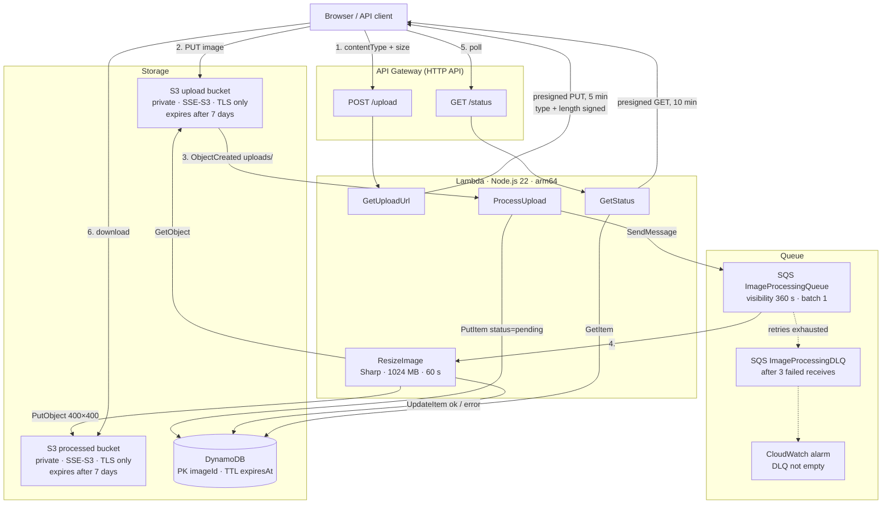

# Serverless Image Processing Pipeline

[](https://github.com/Bydlovskiy/lambda-images/actions/workflows/ci.yml)


An event-driven image pipeline on AWS: the browser uploads straight to S3 through a presigned URL,
an SQS-backed Lambda resizes the image with [Sharp](https://sharp.pixelplumbing.com/), and a tiny
HTTP API reports progress and hands back a presigned download link. Everything — infrastructure,
handlers, tests — is TypeScript, deployed with AWS CDK.

The point of the project is not the resize; it is showing the operational details that separate a
demo from something you would run: dead-lettering, bounded retries, TTLs, least-privilege IAM,
input validation at the edge, and a test suite that pins all of it.

## Architecture



Sequence, state and IAM diagrams: [diagrams/architecture-mermaid.md](diagrams/architecture-mermaid.md).

### Flow

1. **`POST /upload`** — client declares `contentType` and `contentLength`. The Lambda validates
   both (JPEG/PNG/WebP/GIF, ≤ 10 MB) and returns a presigned PUT URL valid for 5 minutes.
2. **PUT to S3** — Content-Type and Content-Length are part of the signature, so S3 rejects any
   upload that does not match what was declared. The bucket is private; the URL is the only way in.
3. **`ObjectCreated`** on `uploads/` triggers **ProcessUpload**: it writes a `pending` record with a
   7-day TTL, then enqueues `{imageId, bucket, key}`.
4. **ResizeImage** consumes the queue one message at a time, decodes with a pixel-count ceiling,
   applies EXIF rotation, crops to 400×400, stores the result and marks the record `ok`.
5. **`GET /status?imageId=…`** returns `pending` / `ok` / `error`; once `ok`, it includes a presigned
   download URL valid for 10 minutes.

## Design decisions

| Concern | What the stack does | Why |
| --- | --- | --- |
| **Poison messages** | Main queue redrives to a DLQ after 3 receives; a CloudWatch alarm fires when the DLQ is non-empty. | Without a DLQ a bad message is retried for the whole 4-day retention period — every attempt downloads from S3, spins up Sharp and writes to DynamoDB. |
| **Permanent vs transient failures** | A corrupt or unsupported image is recorded as `error` and *acknowledged*. S3/DynamoDB failures are recorded and *rethrown*. | Retrying a broken file cannot help; retrying a throttled DynamoDB call can. The DLQ only ever contains things worth a human's attention. |
| **Visibility timeout** | `6 × function timeout` (60 s → 360 s), derived from one constant. | AWS's recommendation for Lambda consumers. Equal values let a message become visible while the previous invocation is still finishing, causing duplicate processing. |
| **Data retention** | DynamoDB TTL on `expiresAt` + S3 lifecycle rules on both buckets, all 7 days. | Records and objects age out together; nothing accumulates silently. |
| **Upload validation** | Type and size are checked in the Lambda *and* signed into the presigned URL. | The Lambda check gives a friendly 400; the signature makes it impossible to bypass by editing the request. |
| **Decompression bombs** | `sharp({ limitInputPixels: 25_000_000 })` | A few-KB PNG can expand to gigabytes of pixels. The cap fails fast instead of OOM-killing a 1 GB function. |
| **Least privilege** | Each function is granted exactly the actions and key prefixes it uses (`uploads/*`, `processed/*`). | Blast radius of a compromised function stays small. |
| **Error responses** | Clients get `{ "error": "Failed to get image status" }`; the stack trace goes to CloudWatch. | Internal ARNs, table names and SDK messages are not a client's business. |
| **Log retention** | Explicit log group per function, 14 days. | Default Lambda log groups never expire. |
| **Sharp on Lambda** | Bundling hook installs the `linux-arm64` build explicitly and fails loudly if it is missing. | `esbuild` cannot bundle native binaries; the naïve approach silently ships the host OS's build and crashes at runtime. |
| **Shared contracts** | `types/image-record.ts` defines the DynamoDB item, the SQS payload and both HTTP responses; every handler imports them. | One definition, one place to change it, and the compiler catches drift. |

## Quick start

Prerequisites: Node.js ≥ 22, npm ≥ 10.4, an AWS account with CLI credentials configured.

```bash
git clone https://github.com/Bydlovskiy/lambda-images.git
cd lambda-images
npm ci

npm run typecheck && npm test         # no AWS access needed
npx cdk bootstrap                     # once per account/region
npm run deploy                        # ~2 minutes
```

Deployment prints the API endpoint:

```
Outputs:
ImageProcessingStack.ApiEndpoint = https://abc123.execute-api.eu-north-1.amazonaws.com/
...
```

### Try it in the browser

```bash
npm start   # serves public/ on http://localhost:3000
```

Open `http://localhost:3000/?api=https://abc123.execute-api.eu-north-1.amazonaws.com` — the endpoint
is remembered in `localStorage`, so the query parameter is only needed once. Drop an image on the
page and watch the event log walk through the pipeline.

### Try it with curl

```bash
API=https://abc123.execute-api.eu-north-1.amazonaws.com

# 1. Request an upload URL for a specific file
FILE=photo.jpg
RES=$(curl -s -X POST "$API/upload" -H 'Content-Type: application/json' \
  -d "{\"contentType\":\"image/jpeg\",\"contentLength\":$(stat -f%z "$FILE")}")
UPLOAD_URL=$(echo "$RES" | jq -r .uploadUrl)
IMAGE_ID=$(echo "$RES" | jq -r .imageId)

# 2. Upload — headers must match what was declared
curl -s -X PUT -H 'Content-Type: image/jpeg' --data-binary @"$FILE" "$UPLOAD_URL"

# 3. Poll until status is "ok"
sleep 5; curl -s "$API/status?imageId=$IMAGE_ID" | jq

# 4. Download the 400×400 result
curl -s "$(curl -s "$API/status?imageId=$IMAGE_ID" | jq -r .downloadUrl)" -o resized.jpg
```

## API

### `POST /upload`

Request:

```json
{ "contentType": "image/jpeg", "contentLength": 245760 }
```

`contentType` ∈ `image/jpeg | image/png | image/webp | image/gif`; `contentLength` is a positive
integer ≤ 10 485 760.

Response `200`:

```json
{
  "uploadUrl": "https://image-upload-….s3.eu-north-1.amazonaws.com/uploads/…?X-Amz-…",
  "imageId": "6f1c1d2e-3b4a-4c5d-8e9f-0a1b2c3d4e5f",
  "key": "uploads/6f1c1d2e-3b4a-4c5d-8e9f-0a1b2c3d4e5f",
  "expiresIn": 300
}
```

`400` with `{ "error": "…" }` on validation failure.

### `GET /status?imageId=<uuid>`

| Status | Response |
| --- | --- |
| pending | `{ "imageId", "status": "pending", "uploadedAt" }` |
| ok | `{ "imageId", "status": "ok", "uploadedAt", "processedAt", "downloadUrl", "expiresIn": 600 }` |
| error | `{ "imageId", "status": "error", "uploadedAt", "errorMessage" }` |

`400` for a missing or malformed `imageId`, `404` if unknown, `500` (no internal details) otherwise.

### DynamoDB item

| Attribute | Type | Notes |
| --- | --- | --- |
| `imageId` | string | partition key, UUID v4 |
| `status` | `pending` \| `ok` \| `error` | |
| `originalKey`, `processedKey` | string | S3 keys |
| `bucket` | string | source bucket |
| `size` | number | original size in bytes |
| `uploadedAt`, `processedAt` | ISO-8601 string | |
| `errorMessage` | string | only when `status = error` |
| `expiresAt` | number | epoch seconds, DynamoDB TTL |

## Testing

```bash
npm test
```

35 tests in five files, no AWS access required:

- **Handlers** — every Lambda runs against `aws-sdk-client-mock`. Sharp is *not* mocked: the resize
  test generates a real 800×600 JPEG and asserts the output decodes to 400×400. There are cases for
  the decompression-bomb limit, malformed queue messages, the permanent-vs-transient error split, and
  the "no error leakage on 500" guarantee.
- **Stack** — `aws-cdk-lib/assertions` pins the infrastructure promises: DLQ with `maxReceiveCount: 3`,
  visibility timeout = 6 × function timeout, TTL on `expiresAt`, 14-day log retention on every function,
  private + encrypted + expiring buckets, exactly two public routes.

CI (`.github/workflows/ci.yml`) runs typecheck, tests and `cdk synth` on every push — the synth step
also proves the Sharp `linux-arm64` bundle builds on a clean machine.

## Project structure

```
├── bin/app.ts                    CDK app entry
├── lib/image-processing-stack.ts All infrastructure (one stack, ~200 lines)
├── lambdas/
│   ├── get-upload-url.ts         POST /upload — validate, sign
│   ├── process-upload.ts         S3 event → DynamoDB + SQS
│   ├── resize-image.ts           SQS → Sharp → S3 + DynamoDB
│   ├── get-status.ts             GET /status
│   └── shared/http.ts            JSON / error response helpers
├── types/image-record.ts         Shared contracts + limits
├── test/                         vitest: handlers + CDK assertions
├── public/index.html             Drag-and-drop demo UI (Tailwind, no build step)
├── diagrams/                     Mermaid diagrams
└── .github/workflows/ci.yml
```

## Operations

```bash
# Follow the resize worker's logs
aws logs tail /aws/lambda/ImageProcessing-ResizeImage --follow

# Anything in the dead-letter queue?
aws sqs get-queue-attributes --queue-url "$(aws cloudformation describe-stacks \
  --stack-name ImageProcessingStack \
  --query 'Stacks[0].Outputs[?OutputKey==`DeadLetterQueueUrl`].OutputValue' --output text)" \
  --attribute-names ApproximateNumberOfMessages

# Preview infrastructure changes before deploying
npm run diff
```

**Cost.** Everything is on-demand. At 1 000 images/month the bill rounds to zero: Lambda, SQS and
DynamoDB stay inside the free tier; S3 storage is a few cents and self-cleans after 7 days.

**Tear down.** `npm run destroy` removes every resource, including bucket contents and log groups
(all removal policies are `DESTROY` — this is a demo, not a system of record).

## Limitations and next steps

Deliberately out of scope, but the natural next increments:

- **Auth** — the API and CORS are wide open. Put an authorizer (Cognito / JWT) on the HTTP API and
  restrict `allowOrigins` to the real frontend.
- **Multiple sizes / formats** — `resize-image.ts` produces one 400×400 crop. A fan-out to several
  variants would be a second queue or an SQS message per variant.
- **Notifications** — clients poll `/status`. WebSocket API or EventBridge → SNS would push instead.
- **Provisioned concurrency** — the Sharp function has a noticeable cold start; fine for a
  queue consumer, worth tuning if the pipeline ever becomes latency-sensitive.

## License

MIT — see [LICENSE](LICENSE).
