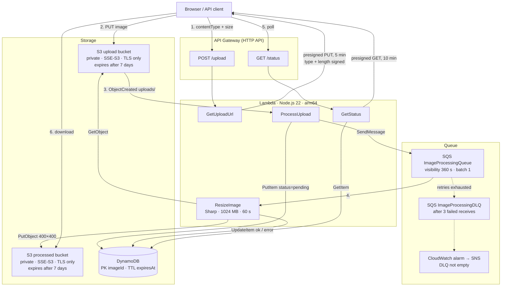
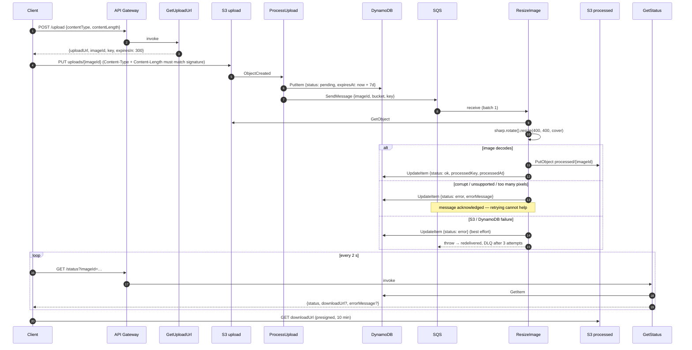
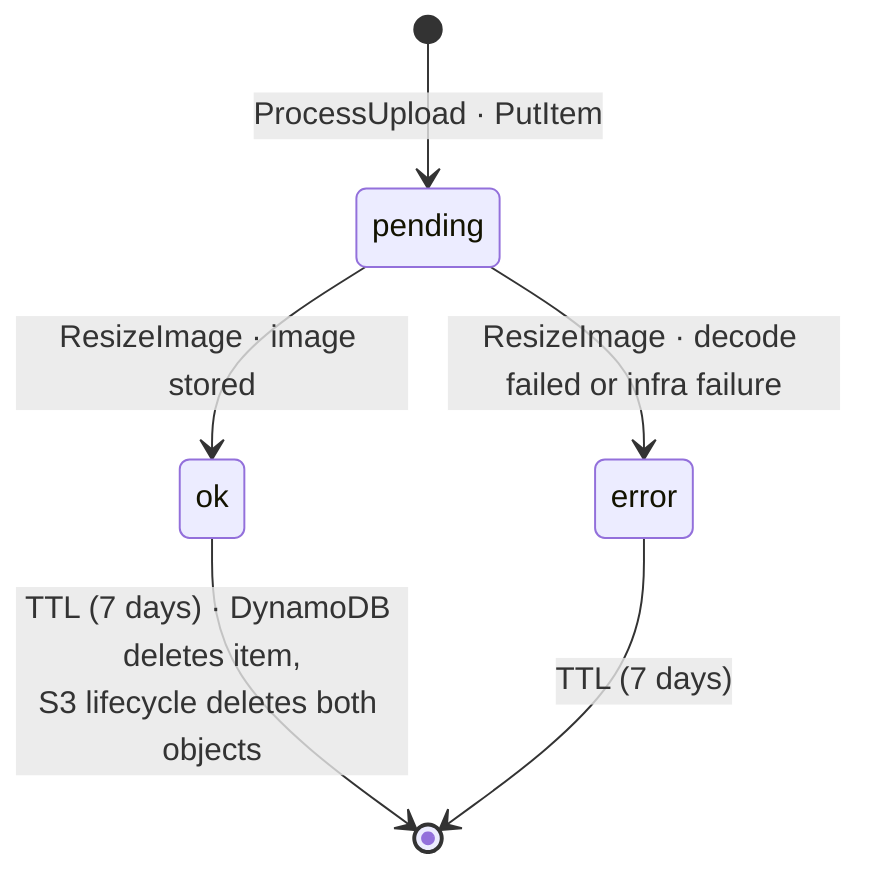

# Architecture diagrams

All diagrams are Mermaid and render natively on GitHub. Values (timeouts, retention, limits) mirror
`lib/image-processing-stack.ts` and are pinned by `test/stack.test.ts`.

## System overview

## Sequence

## Record lifecycle

## IAM grants (least privilege)

| Function       | S3 upload bucket        | S3 processed bucket       | DynamoDB      | SQS            |
| -------------- | ----------------------- | ------------------------- | ------------- | -------------- |
| GetUploadUrl   | `PutObject uploads/*`   | —                         | —             | —              |
| ProcessUpload  | — (event source only)   | —                         | write         | `SendMessage`  |
| ResizeImage    | `GetObject uploads/*`   | `PutObject processed/*`   | write         | consume        |
| GetStatus      | —                       | `GetObject processed/*`   | read          | —              |
