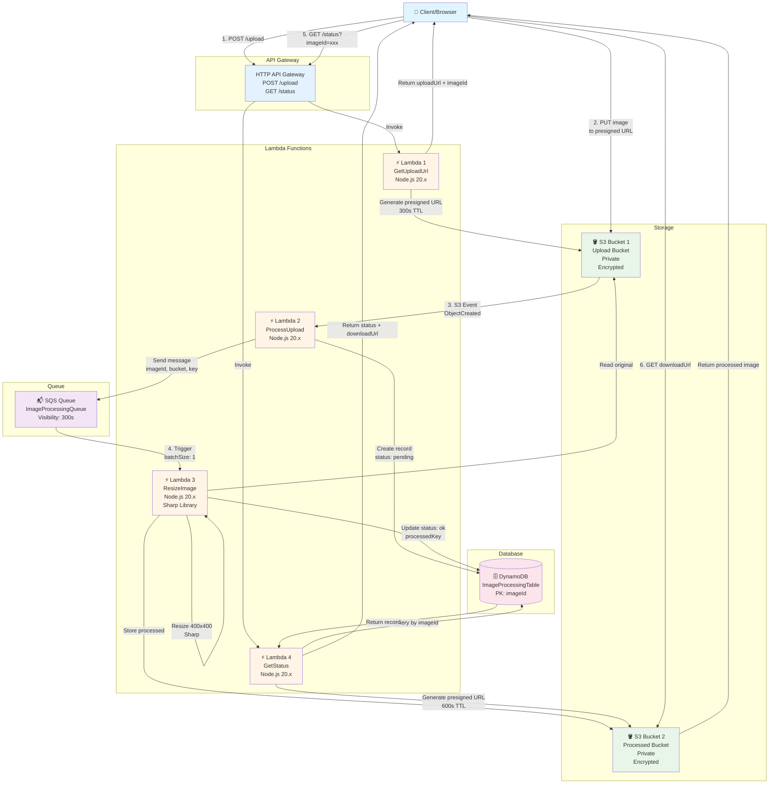
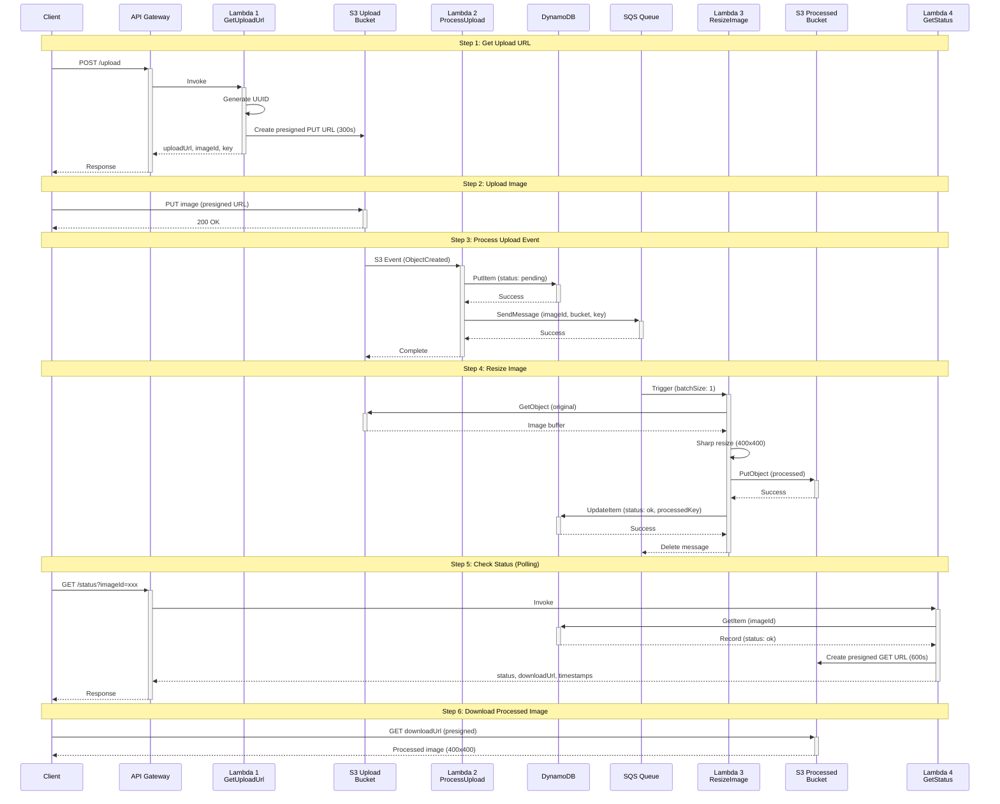
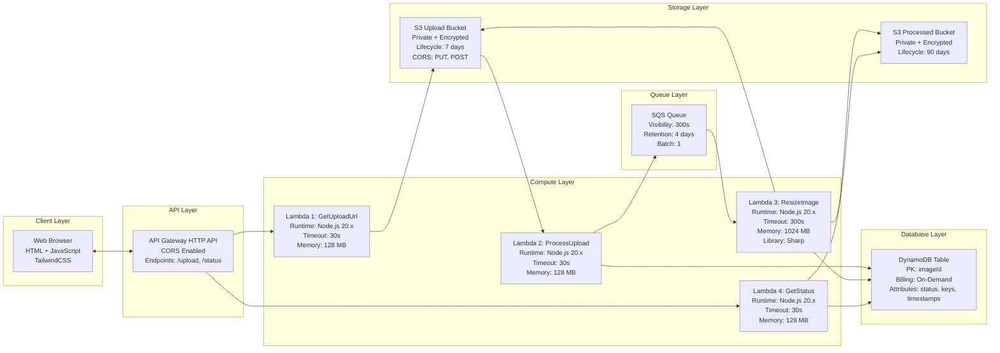
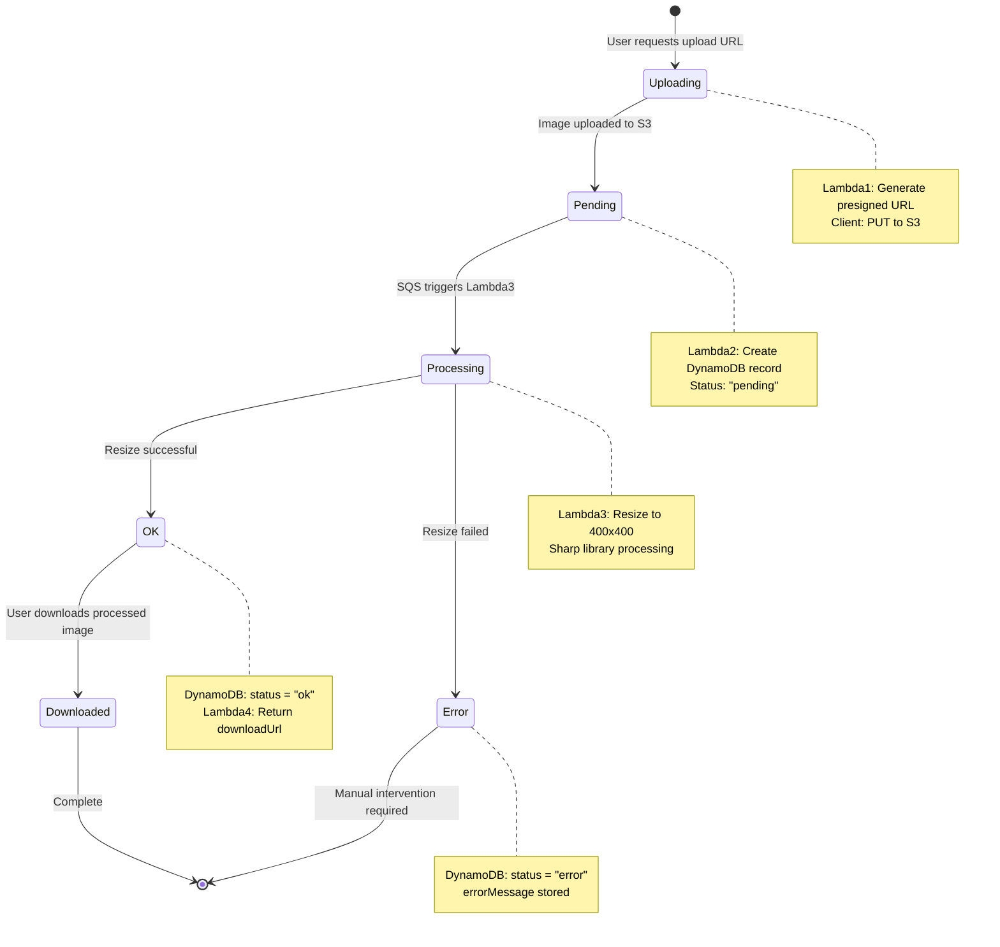
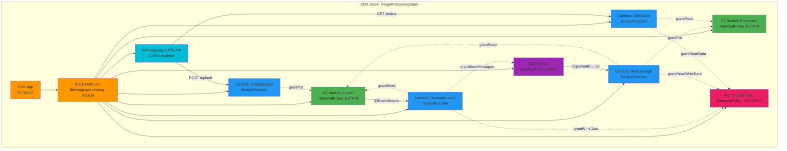
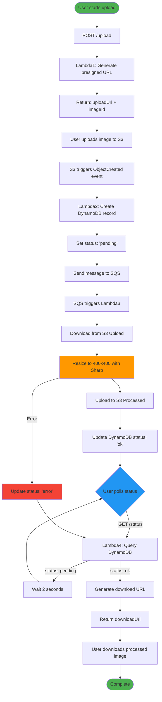
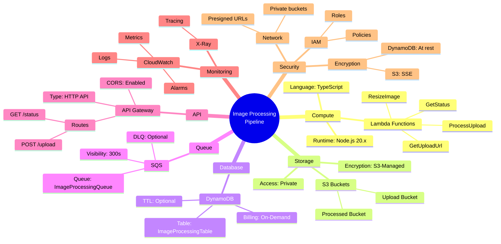

# AWS Image Processing Pipeline - Architecture Diagram

## Interactive Mermaid Diagram



## Sequence Diagram



## Component Diagram



## State Diagram (Image Processing Status)



## Infrastructure as Code (CDK Resources)



## Data Flow Diagram



## AWS Services Used



---

## How to View These Diagrams

### GitHub
These Mermaid diagrams will render automatically on GitHub when viewing this file.

### VS Code
Install the "Markdown Preview Mermaid Support" extension to view diagrams in preview.

### Online
Copy the Mermaid code and paste it into:
- https://mermaid.live/
- https://mermaid-js.github.io/mermaid-live-editor/

### Export as Image
Use Mermaid CLI to export as PNG/SVG:
```bash
npm install -g @mermaid-js/mermaid-cli
mmdc -i architecture-mermaid.md -o architecture.png
```

---

## Architecture Highlights

### ✅ Serverless Architecture
- No servers to manage
- Auto-scaling
- Pay-per-use pricing

### ✅ Event-Driven Design
- S3 events trigger processing
- SQS decouples components
- Asynchronous processing

### ✅ Secure by Default
- Private S3 buckets
- Presigned URLs with expiration
- IAM least privilege
- Encryption at rest

### ✅ Resilient
- Lambda automatic retries
- SQS message persistence
- DynamoDB high availability
- Error tracking in database

### ✅ Observable
- CloudWatch Logs for all Lambdas
- Metrics for monitoring
- X-Ray tracing (optional)
- Status tracking in DynamoDB

### ✅ Cost-Effective
- Serverless pricing model
- On-demand DynamoDB
- S3 lifecycle policies
- Estimated: <$1 for 1000 images/month
